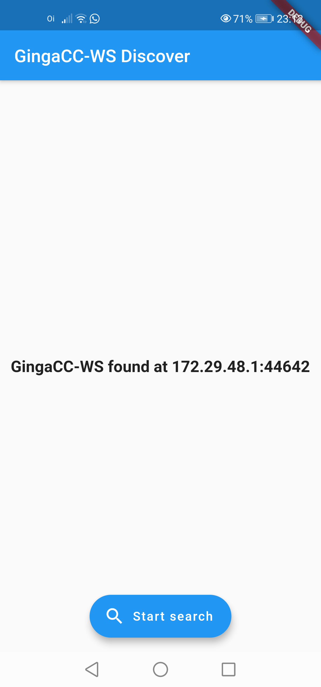

# ginga-examples-ws-discover


GingaCC WebServices is a service running at Ginga TV middleware with API to support second screen and SmartTV applications.
This project has a mock server and code examples to discover this service.

## mock server

``` bash
npm install
node mock-server.js
```

## cmd clients

#### Node client

``` bash
npm install
node discover.js
```

#### Dart client

``` bash
dart discover.dart
```

#### Dotnet client

``` bash
cd discover_dotnet
dotnet run
```

#### flutter client

``` bash
cd discover_flutter
flutter run
```

The next screenshot shown the flutter client after find the mock-server address.


